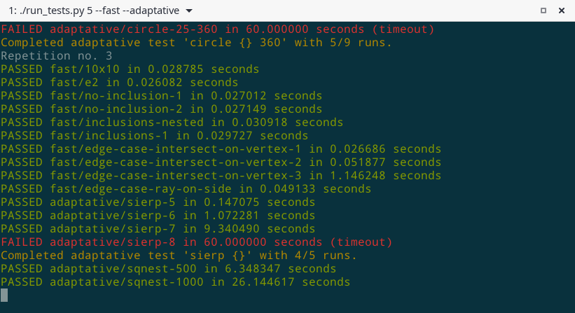

# polygon-adaptive-test

Bienvenue dans le dépôt du générateur de polygones et testeur adaptatif de votre projet d'algo 2020 !



## Qu'est-ce que c'est ?

Concrètement, ce programme a deux fonctions :

1. **Générer des fichiers .poly** de plus en plus difficiles (avec plus de polygones, plus de segments, des configurations complexes, etc.)
2. **Tester votre programme** sur ces polygones, et mesurer son temps d'exécution.
Votre résultat est également *vérifié*, vous permettant de détecter les erreurs dans votre algorithme.


Comme son nom l'indique, ce processus est **adaptatif**, c'est-à-dire qu'il faut que votre programme passe les tests les plus simples (avec peu de polygones/de segments) avant de pouvoir attaquer les tests plus difficiles. Les fichiers .poly sont générés à la demande.


## Familles de tests

Les tests sont répartis en différentes familles, qui correspondent à une configuration de polygones.
Par exemple, tous les tests de la famille `sqline` portent sur des carrés ("squares") alignés les
uns à côté des autres. La difficulté change selon un ou plusieurs paramètres qui contrôlent le
générateur de polygones.


Voici les différentes familles disponibles pour l'instant :

| Nom abrégé | Description                                             | Paramètre(s)                     |
| ---------- | ------------------------------------------------------- | -------------------------------- |
| fast       | Tests faits main pour vérifier votre programme*         | -                                |
| sierp      | [Triangle de Sierpinski "espacé"](img/sierpinski-8.png) | niveau de récursion              |
| sqnest     | Carrés imbriqués                                        | nombre de carrés                 |
| sqline     | Ligne de carrés                                         | nombre de lignes                 |
| sqgrid     | Grille de carrés                                        | lignes, colonnes                 | 
| circnest   | Cercles imbriqués                                       | cercles, points / cercle         |
| circline   | Ligne de cercles                                        | cercles, points / cercle         |
| circgrid   | Grille de cercles                                       | lignes, colonnes, points/cercle  |
| puzzle     | "Pièces de puzzle" emboîtées les unes dans les autres   | hauteur, largeur                 |
| fakesqnest | Polygones indépendants mais tels que leur "bounding box" sont imbriquées | nb. polygones   |
| hexa       | Fractale d'hexagones indépendants                       | niveau de récursion              |
| sqfrac     | Fractale de carrés imbriqués                            | niveau de récursion              |
| battle     | Bataille de territoires entre agents sur une grille     | lignes, colonnes, agents, tours, graine |  

\* Avec geogebra, puis conversion au format pst puis poly.
Sources dans [handmade-tests/geogebra-sources](handmade-tests/geogebra-sources).
*Note : sur geogebra l'axe Y est vers le haut, alors qu'en svg il est vers le bas.
Mais ça ne change rien pour ces tests.*

**Remarque sur la vérification :** la vérification est plus complète si vous lancez le rayon du test "point-in-polygon" vers la droite (vecteur directeur x=1,y=0)
comme suggéré dans le sujet du projet d'algo.

## Installation

Vous avez besoin de **Python 3.6+** et d'un terminal.

1\. Clonez ce dépôt :
```
git clone git@gitlab.ensimag.fr:raffingu/polygon-adaptive-test.git
```

2\. Installez les dépendances :
```
pip install --user -r requirements.txt
```

*Si `pip --version` mentionne "python 2.7" ce n'est pas le bon -> utilisez `pip3`*

***Ensimag :** sur les machines de l'ensimag, c'est `python3.6 -m pip` qu'il faut utiliser*

3\. Configurez les tests :  
Cette étape est optionnelle si vous avez cloné `polygon-adaptive-test` à côté de votre projet d'algo.
```
export POLY_PROGRAM="chemin/vers/mon-projet-algo/main.py"
export POLY_OUTPUT="chemin/vers/dossier-resultats-des-tests"
```

## Utilisation

Le script de test se lance **depuis le dépôt polygon-adaptive-test** et non depuis votre projet.

Exemple de commande :
```
./run_tests 1 fast sqline
```

 - "1" est le nombre de répétitions du test complet (pour lisser les fluctuations dans les mesures)
 - "fast" et "sqline" sont deux familles de tests

Au fur et à mesure des tests, un fichier CSV est mis à jour avec les résultats.

*Protip : Utilisez l'option `--help` pour avoir de l'aide et `--list` pour afficher tous les tests disponibles.*

### Interrompre le test

Vous pouvez arrêter le test à tout moment en utilisant Ctrl+C. Un premier Ctrl+C arrêtera le processus en cours
(soit la génération d'un polygone, soit l'exécution de votre programme), et un deuxième juste après arrêtera tout
le script de test. Les résultats obtenus sur les tests déjà terminés seront quand même sauvegardés.

*Note : si Ctrl+C ne marche pas, il faut appuyer + de fois et + vite !*

### Génération lente

Certains tests (sierpinski notamment) prennent plusieurs minutes à se générer quand le paramètre est élevé.
Heureusement, le script de test détecte les tests qui existent déjà et ne génère que ceux qui lui manquent.

### Mémoire vive

Certains tests consomment beaucoup (> 1Go) de RAM pour se générer et/ou s'exécuter. C'est normal, mais ça peut
vous empêcher de passer le test si vous avez trop peu de mémoire disponible.

## Contribution

Les contributions sont les bienvenues !

Si vous avez un super concept de test ou un générateur déjà fonctionnel, incluez-le à ce projet !

J'ajouterai peut-être un fichier CONTRIBUTE.md avec des explications sur le code et le processus
de contribution. Si vous êtes intéressés, n'hésitez pas à me le dire et pourquoi pas à directement envoyer
une pull request :-)

### Bugs

J'utilise régulièrement ce programme, mais il n'est pas immunisé aux bugs pour autant.
Si vous en trouvez un et qu'il n'a pas déjà été signalé (et que c'est vraiment un bug !),
vous pouvez [ouvrir une "issue" GitLab](https://gitlab.ensimag.fr/raffingu/polygon-adaptive-test/-/issues).

Rapporter un bug est aussi une forme de contribution.
